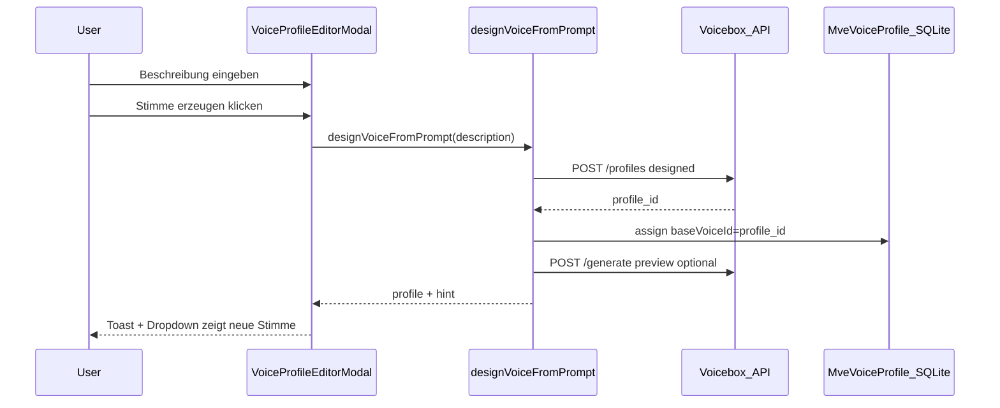

# Design: MVE Prompt-to-Voice (Voicebox Designed Profiles)

<!-- generated by @feature-intake — 2026-07-13 — parent: multi-voice-engine, extends mve-voice-studio-0.4 -->

## Problem & Intent

Nutzer erwarten unter **„Stimme aus Beschreibung“**, dass Scriptony aus einem Text-Prompt eine **neue** Stimme erzeugt (Prompt-to-Voice). Aktuell liefert MVP 0.4 nur **Katalog-Matching** (`match-voice-from-description.ts`) — die UI sagt das explizit („kein Prompt-to-Voice“).

Ziel: Im bestehenden `VoiceProfileEditorModal` eine echte **Design-Voice-Pipeline** über Voicebox anbinden: Prompt → Voicebox-Profil `voice_type=designed` → Charakter zuweisen → Vorschau abspielbar.

## Non-Goals (MVP / Ponytail Rung 1)

- **Katalog-Matching entfernen** — „Stimme vorschlagen“ bleibt als schneller Pfad
- ElevenLabs / Cloud Prompt-to-Voice
- OpenVoice / externe Design-APIs
- Globale Voice-Library außerhalb Charakter-Modal
- Personality-Rewrite (`personality: true` auf `/generate`) — später
- Mehrere Design-Varianten pro Klick (A/B-Stimmen) — später

## Assumptions

- Voicebox läuft lokal (`/Applications/Voicebox.app`, Port 17493); Dev-Proxy `/__voicebox` aktiv
- Designed Voices nutzen `POST /profiles` mit `voice_type: designed`, `design_prompt`, `default_engine: qwen_custom_voice` (OpenAPI `VoiceProfileCreate`)
- Erste Generierung kann TTS-Modell laden (`model_loaded: false`) — Global Loading Progress >5s
- Provider **Eigene Stimmen** (`voicebox`) ist der natürliche Heimat-Provider nach Erzeugung; Design-Flow auch aus Preset-Providern erreichbar (Ergebnis landet als User-Profil)
- Desktop-only (`isDesktopShell()`); kein Appwrite-Function-Pfad in MVP

## Was im Repo schon da ist

| Pfad | Relevanz |
|------|----------|
| [`src/lib/api/voicebox-api.ts`](src/lib/api/voicebox-api.ts) | `createVoiceboxProfile` mit `voiceType: "designed"` — **ohne** `design_prompt` |
| [`src/lib/mve/casting/generate-voice-from-description.ts`](src/lib/mve/casting/generate-voice-from-description.ts) | Katalog-Matching (bestehend) |
| [`src/components/characters/VoiceStudioGenerateSection.tsx`](src/components/characters/VoiceStudioGenerateSection.tsx) | UI „Stimme vorschlagen“ |
| [`src/components/characters/VoiceProfileEditorModal.tsx`](src/components/characters/VoiceProfileEditorModal.tsx) | `handleSuggestFromDescription` → Matching |
| [`src/lib/mve/assign-voice-profile.ts`](src/lib/mve/assign-voice-profile.ts) | Charakter-Zuweisung |
| [`src/hooks/useGlobalLoadingProgress.tsx`](src/hooks/useGlobalLoadingProgress.tsx) | Lange Design/Generate-Jobs |
| [`.qa/design/mve-voice-studio-0.4.md`](.qa/design/mve-voice-studio-0.4.md) | Explizit: echtes P2V war **Non-Goal** in 0.4 |

## Voicebox API (verifiziert live OpenAPI 0.5.0)

```
POST /profiles
  voice_type: "designed"
  design_prompt: string (max 2000)
  personality?: string
  default_engine: "qwen_custom_voice"
  language: "de" | ...

POST /generate
  profile_id: <designed profile uuid>
  text: previewText
  engine: "qwen_custom_voice"
```

Kein separater `/design-voice`-Endpoint — Design passiert über Profil-Erstellung + Generate.

## Options

| Option | Pros | Cons |
|--------|------|------|
| **A: Voicebox `designed` profile** (empfohlen) | API vorhanden; passt zu Eigene Stimmen; kein neues Sidecar | Abhängig von Qwen Custom Voice in Voicebox |
| B: Nur Katalog + Tune | Bereits shipped | Kein echtes P2V — User-Erwartung verfehlt |
| C: Lokales LLM + Preset | Kein Voicebox-Design | Doppelpfad, wartet auf Modell |

**Decision:** Option A — Voicebox designed profiles.

## User Flow (MVP)



## UI-Anker

- **Einstieg:** Characters → `VoiceProfileEditorModal` → Abschnitt „Stimme aus Beschreibung“
- **Änderung:** Zwei Buttons oder Primary/Secondary:
  - **Stimme vorschlagen** — bestehendes Katalog-Matching (schnell)
  - **Stimme erzeugen** — neues Prompt-to-Voice (langsamer, Global Progress)
- Copy auf Deutsch; klar unterscheiden Katalog vs. Erzeugen

## Runtime matrix

| Slice | Local desktop | Cloud session | Functions |
|-------|---------------|---------------|-----------|
| voicebox-api designed | yes | no | skip |
| designVoiceFromPrompt | yes | no | skip |
| UI + progress | yes | hidden | skip |
| E2E mock | yes | — | — |

## Cross-Domain Sign-Off

| Domain | Status | Note |
|--------|--------|------|
| KISS | yes | Ein Voicebox-API-Pfad, kein zweites TTS-System |
| Security | yes | Kein neuer Upload; Prompt nur an localhost Voicebox |
| UX | yes | Zwei klare Aktionen; Loading >5s global |
| Testability | yes | Mock `/__voicebox/profiles` POST + generate |

## Implementation Sketch

```
src/lib/api/voicebox-api.ts
  createDesignedVoiceboxProfile({ name, designPrompt, language, personality? })

src/lib/mve/casting/design-voice-from-prompt.ts   # NEW
  designVoiceFromPrompt({ projectId, characterId, characterName, description, previewText, existingProfile? })

src/components/characters/VoiceStudioGenerateSection.tsx
  onDesign + second button „Stimme erzeugen“

src/components/characters/VoiceProfileEditorModal.tsx
  handleDesignFromDescription → runWithProgress

.qa/acceptance/mve-prompt-to-voice.md
```

## Deferred (nicht in diesem Epic)

- Provider-auto-switch nach Design zu „Eigene Stimmen“
- Regenerate / Seed-Variationen
- Cloud-Hybrid Prompt-to-Voice
- PRD §6.5 Performance Reference

## Ready for /implement

NO — Issue-Entwurf review → Issues anlegen → `@ecc-runner`.
