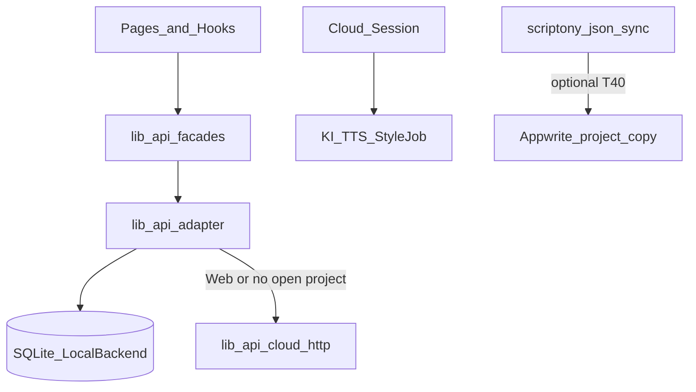

# Local / Cloud Architecture (3 Achsen)

> **Audience:** Contributors and agents.  
> **Principle:** KISS · SOLID · DRY — one dispatch layer, domain names in code, HTTP routes only in `*-cloud-http.ts`.

Canonical desktop workflow: [DESKTOP_FIRST_DEV.md](DESKTOP_FIRST_DEV.md).  
Domain mapping table: [DOMAIN_GLOSSAR.md](DOMAIN_GLOSSAR.md).  
Capability gates: [`src/capabilities/registry.ts`](../src/capabilities/registry.ts).

---

## Three axes (do not merge)

| Axis | Question | Control in repo |
|------|----------|-----------------|
| **1. Shell** | Where does the app run? | [`detect-runtime.ts`](../src/runtime/detect-runtime.ts) — Tauri → `profile: local` by default |
| **2. Cloud session** | Is the user logged in at Appwrite? | [`cloud-session.ts`](../src/lib/auth/cloud-session.ts), JWT via `getAuthToken()` |
| **3. Data placement** | Where is this project’s data stored / synced? | [`scriptony.json`](../src/local/project-manifest.ts) `storageMode`, `sync.*` — [T40](../tickets/done-T40-implementation-cloud-sync-pro-projekt-aktivieren.md) |



### Axis 1 — Shell

- **Desktop (Tauri):** Offline-first. Domain CRUD uses SQLite when a `.scriptony` project is open (`dispatchByRuntime`, `usesCloudHttpForDomain`).
- **Browser:** `profile: cloud` — Appwrite backend via [`AppwriteBackend`](../src/backend/appwrite/AppwriteBackend.ts).

**Not the same as:** “user logged in” or “project synced to cloud”.

### Axis 2 — Cloud session

- **Login** enables hybrid **capabilities** (KI, TTS, style-guide jobs) — not a switch of the whole desktop app to `AppwriteBackend`.
- `canUseCloudSession()` = valid JWT.
- `canUseCloudFeatures()` = JWT **and** Appwrite endpoint/project configured.

### Axis 3 — Data placement (per project)

- Default: **local-only** (`storageMode: local`, `sync.enabled: false`).
- **Cloud Sync aktivieren** (T40): creates/links Appwrite project, sets `cloudProjectId`; **project folder and SQLite remain**.
- **Daily CRUD stays local** even when `sync.enabled` until a future `ProjectSyncEngine` defines otherwise.

---

## Layer rules (KISS / SOLID / DRY)

| Layer | Responsibility | UI may import? |
|-------|----------------|----------------|
| `src/lib/api/*.ts` | Stable facades | **Yes** |
| `src/lib/api/*-cloud-http.ts` | Gateway routes only | **No** |
| `src/lib/api-adapter/*-adapter.ts` | `dispatchByRuntime` / `usesCloudHttpForDomain` | **No** |
| `src/lib/api-adapter/*-local.ts` | `requireLocalBackend()` | **No** |
| `src/backend/local/` | SQLite repositories | Via backend hooks only |
| `src/backend/sync/` | Per-project cloud activation (T40) | Via services, not pages |

**DRY:** One adapter per domain. Do not add `timeline-*` as **domain** file names — use glossary names (e.g. `ProjectCharacter`).

---

## Worlds (Phase 4 MVP)

On desktop, worlds are often **synthetic** per project: `local-world-{projectId}` ([`worlds-core.ts`](../src/lib/api-adapter/worlds-core.ts)).  
Dedicated `.scriptony-world` folders and world-level sync are **planned** — see `WorldSyncFlags` sketch in this doc § Future.

```ts
// Sketch — not yet in manifest validator
interface WorldSyncFlags {
  enabled: boolean;
  cloudWorldId?: string;
  syncStatus: "disabled" | "pendingActivation" | "active" | "error";
}
```

UI may show “Welt-Sync: demnächst / nur lokal” until implemented.

---

## Feature capabilities (registry)

See [`src/capabilities/registry.ts`](../src/capabilities/registry.ts):

| Kind | Meaning |
|------|---------|
| `LOCAL_ALWAYS` | Never calls Appwrite for data |
| `LOCAL_WHEN_PROJECT_OPEN` | Desktop domain CRUD → SQLite |
| `CLOUD_SESSION` | Needs Appwrite login (hybrid) |
| `CLOUD_SYNC_PROJECT` | Per-project T40 activation |
| `LOCAL_ONLY` | No cloud path by design (e.g. Stage) |

---

## Explicitly out of scope here

- Bidirectional real-time sync (separate ticket / `ProjectSyncEngine`)
- Renaming server routes (e.g. `/timeline-characters`)
- Global desktop “switch app to cloud mode” for end users

---

## Repo map (quick)

```
src/backend/local/          SQLite source of truth (desktop)
src/backend/appwrite/       Web cloud backend
src/backend/sync/           Project → cloud activate (T40)
src/lib/api/                Facades (UI imports)
src/lib/api-adapter/        Routing + *-local.ts
src/lib/api/*-cloud-http.ts HTTP to Functions gateway
src/capabilities/           Feature capability registry
src/modules/creative-gym/   User-scoped gym data (not project sync)
```
