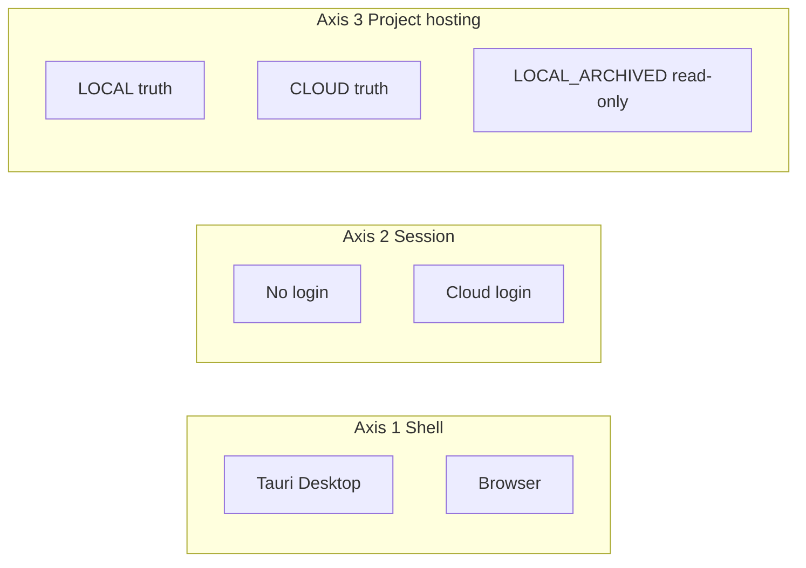

# Multihost Blueprint — Local-First Apps with Optional Cloud (Team Live)

> **Audience:** Humans and AI agents building new apps (Scriptony, VisuDev, …).  
> **Purpose:** Give this document to an AI and say: *“Build app XY following this architecture.”*  
> **Principle:** KISS · SOLID · DRY — one placement router, domain language in code, provider adapters at the edges.

**Related (Scriptony prototype):** [ARCHITECTURE_LOCAL_CLOUD.md](ARCHITECTURE_LOCAL_CLOUD.md) · [DOMAIN_GLOSSAR.md](DOMAIN_GLOSSAR.md) · [DESKTOP_FIRST_DEV.md](DESKTOP_FIRST_DEV.md)

---

## 1. Product principle (one sentence)

**The app is offline-first and fully usable alone on the device; cloud is optional for team collaboration and managed services — either your hosted stack or the user’s self-hosted instance of the same API contract.**

---

## 2. What “Multihost” means here

| Means | Does **not** mean |
|-------|-------------------|
| App runs **locally** (desktop shell) with full single-user features | “Any backend” wired ad hoc in UI |
| **Cloud features** via managed server **or** self-hosted **same API** | Multi-tenant in one codebase without clear axes |
| **Same architecture pattern** across products (Scriptony, VisuDev, …) | Copy-paste Scriptony’s Appwrite routes into every app |

**Multihost** = **multiple hosting targets** for cloud (managed vs self-hosted) + **local-first shell**, not “Supabase + Convex + Appwrite in one screen.”

---

## 3. Three axes (never merge)

These answer **different questions**. Do not use one flag for all three.

| Axis | Question | Examples |
|------|----------|----------|
| **1. Shell** | Where does the UI run? | Tauri desktop, browser, (mobile later) |
| **2. Cloud session** | Is the user logged in to a cloud identity? | JWT, OAuth — optional for local-only work |
| **3. Project hosting** | Where is **this project’s** truth? | `LOCAL` · `CLOUD` · `LOCAL_ARCHIVED` |



**Scriptony today:** Axes 1–2 are implemented; axis 3 uses `sync.*` on `scriptony.json` (T40) as a **stepping stone** — target model is §5 below.

---

## 4. Project hosting modes (binding)

| Mode | `hostingMode` | Source of truth | Editable | Offline | Login |
|------|---------------|-----------------|----------|---------|-------|
| **Local (default)** | `LOCAL` | Device (SQLite + files) | Yes | Yes | No |
| **Cloud team (live)** | `CLOUD` | Server (DB + API + realtime) | Yes (online) | No in v1 | Yes |
| **Local archive** | `LOCAL_ARCHIVED` | Frozen snapshot on device | **Read-only** | View only | Optional |

### 4.1 Cloud activation — Model A (binding)

When the user enables **Cloud / Team** for a **LOCAL** project:

1. **One-time upload** of full project state to the server (manifest, DB, assets).
2. Server creates **`cloudProjectId`**; project becomes **`hostingMode: CLOUD`**.
3. **Local copy** becomes **`hostingMode: LOCAL_ARCHIVED`** — not editable, not a sync source.
4. All **further writes** go to **`CloudLiveBackend`** only (server truth).
5. **Multi-user** uses **realtime events** (Figma-style): everyone sees changes live; no LWW between local and cloud for the same instance.
6. If upload **fails**, local project stays **`LOCAL`** and editable.

**Forbidden:** Bidirectional sync between `LOCAL` and `CLOUD` for the same project instance. No “edit locally while cloud team is live on the same project.”

### 4.2 New project choice

At create time, offer:

- **Local only** → `LOCAL` (default)
- **Cloud team from start** → `CLOUD` on server (no migration)

### 4.3 Optional later: refresh archive

**Download snapshot** from server into `LOCAL_ARCHIVED` for backup/viewing — still read-only, not merge.

---

## 5. User journeys

### 5.1 Single user (local)

```
Open app → pick workspace → create/open LOCAL project → full features offline
```

No cloud login required.

### 5.2 Enable cloud / team (Model A)

```
LOCAL project open → user logs in → "Cloud / Team aktivieren"
  → upload progress UI
  → on success: open CLOUD project on server
  → local folder becomes LOCAL_ARCHIVED (badge "Archiv — nur lesen")
```

Attempt to edit archive → block with message: *Open the cloud project to edit.*

### 5.3 Cloud project (Figma-like)

```
User opens CLOUD project → all reads/writes via API
  → subscribe realtime channel project:{cloudProjectId}
  → on remote event → patch UI (no full page reload)
```

v1: **online required** for editing cloud projects.

---

## 6. Architecture layers (mandatory)

```
┌─────────────────────────────────────────────────────────┐
│  UI (pages, components) — no direct fetch to providers   │
└───────────────────────────┬─────────────────────────────┘
                            │
┌───────────────────────────▼─────────────────────────────┐
│  Feature hooks + Capability gates (registry)             │
└───────────────────────────┬─────────────────────────────┘
                            │
┌───────────────────────────▼─────────────────────────────┐
│  Domain facades (stable product API, e.g. lib/api)       │
└───────────────────────────┬─────────────────────────────┘
                            │
┌───────────────────────────▼─────────────────────────────┐
│  Placement adapters (route by hostingMode + shell)       │
└─────────────┬─────────────────────────────┬─────────────┘
              │                             │
    ┌─────────▼─────────┐         ┌─────────▼─────────┐
    │ LocalBackend       │         │ CloudLiveBackend   │
    │ SQLite + files     │         │ HTTP + Realtime    │
    │ LOCAL / ARCHIVED RO│         │ CLOUD only         │
    └────────────────────┘         └─────────┬─────────┘
                                             │
                                   ┌─────────▼─────────┐
                                   │ Provider transport │
                                   │ Appwrite / Supabase│
                                   │ / custom OpenAPI   │
                                   └────────────────────┘
```

### 6.1 Folder conventions (template)

| Path | Responsibility | UI imports? |
|------|----------------|-------------|
| `src/runtime/` | Shell detection, profile | Hooks only |
| `src/lib/auth/` | `AuthProvider` interface + impls | Via auth hook |
| `src/backend/` | `AppBackend` repositories | Via provider/hooks |
| `src/lib/api/` | Domain facades | **Yes** |
| `src/lib/api-adapter/` | Placement routing | **No** |
| `src/lib/api/*-remote.ts` or `*-cloud-http.ts` | HTTP to **your** OpenAPI | **No** |
| `src/capabilities/` | Feature capability registry | Gates in hooks |
| `src/local/` or `src/project/` | Manifest, workspace, migration | Services |

**Forbidden:** `if (appwrite)` in components. **Forbidden:** HTTP path names as domain module names (`timeline-characters-api.ts`).

---

## 7. Core interfaces (sketch)

### 7.1 Project manifest

```ts
type ProjectHostingMode = "LOCAL" | "CLOUD" | "LOCAL_ARCHIVED";

interface ProjectManifest {
  format: string;           // e.g. "myapp-project"
  version: number;
  projectId: string;        // stable id (traceability)
  title: string;
  hostingMode: ProjectHostingMode;
  cloudProjectId?: string;
  promotedToCloudAt?: string;  // ISO — when LOCAL → CLOUD
  archiveOfCloudId?: string;   // LOCAL_ARCHIVED → cloud id
  createdAt: string;
  updatedAt: string;
}
```

### 7.2 Project hosting router

```ts
type BackendRoute = "local_rw" | "local_ro" | "cloud_live";

function routeProjectBackend(manifest: ProjectManifest): BackendRoute {
  switch (manifest.hostingMode) {
    case "LOCAL":
      return "local_rw";
    case "LOCAL_ARCHIVED":
      return "local_ro";
    case "CLOUD":
      return "cloud_live";
  }
}
```

Combine with **shell** routing (desktop local profile vs browser):

```ts
async function dispatchByPlacement<T>(
  manifest: ProjectManifest,
  local: () => Promise<T>,
  cloud: () => Promise<T>,
): Promise<T> {
  const route = routeProjectBackend(manifest);
  if (route === "local_ro") {
    throw new Error("Project is read-only archive");
  }
  if (route === "local_rw") return local();
  return cloud();
}
```

### 7.3 AuthProvider (independent of backend)

```ts
interface AuthProvider {
  getSession(): Promise<AuthSession | null>;
  getAccessToken(): Promise<string | null>;
  signIn(...): Promise<AuthSession>;
  signOut(): Promise<void>;
  onAuthStateChange(cb): () => void;
}
```

Implementations: `LocalNoAuthProvider` · `AppwriteAuthProvider` · `SupabaseAuthProvider` · …

**Rule:** Login required only for capabilities that need it (see §8), not at app startup for local work.

### 7.4 AppBackend (domain repositories)

```ts
interface AppBackend {
  readonly auth: AuthProvider;
  readonly projects: ProjectRepository;
  // … per domain glossary: characters, structure, shots, etc.
}
```

- **`LocalBackend`** — SQLite + filesystem (`LOCAL`, read-only for `LOCAL_ARCHIVED`).
- **`CloudLiveBackend`** — mutates server + subscribes to realtime (`CLOUD`).

Provider-specific SDKs stay **inside** transport adapters, not in `AppBackend` interface.

### 7.5 CloudLiveBackend (Figma-style)

```ts
interface CloudLiveBackend extends AppBackend {
  subscribe(
    cloudProjectId: string,
    onEvent: (event: ProjectRealtimeEvent) => void,
  ): () => void;
}
```

**Mutation flow:**

1. Client calls `PATCH /v1/projects/{id}/…` (or RPC).
2. Server persists + broadcasts `{ type, entityId, patch }`.
3. All clients apply patch to view state.

Optional v1.1: presence (who is online, cursor/selection).

---

## 8. Capability registry

Every feature declares what it needs **before** calling APIs.

```ts
type CapabilityKind =
  | "LOCAL_ALWAYS"              // never needs cloud
  | "LOCAL_WHEN_PROJECT_OPEN"   // desktop/local CRUD
  | "CLOUD_SESSION"             // needs login (JWT)
  | "CLOUD_PROJECT"             // hostingMode === CLOUD
  | "CLOUD_PROMOTE"             // can run promote LOCAL → CLOUD
  | "AI_LOCAL"                  // local model (Ollama, etc.)
  | "AI_BYOK"                   // user API key, stored locally
  | "AI_MANAGED";               // your hosted AI functions
```

| Feature type | Typical capability |
|--------------|-------------------|
| Domain CRUD (local project) | `LOCAL_WHEN_PROJECT_OPEN` |
| Open cloud project | `CLOUD_SESSION` + `CLOUD_PROJECT` |
| Team promote | `CLOUD_SESSION` + `CLOUD_PROMOTE` |
| Collaboration | `CLOUD_PROJECT` (realtime) |
| KI/TTS managed | `CLOUD_SESSION` or `AI_MANAGED` |
| KI with OpenAI key | `AI_BYOK` |
| Parser / AST (VisuDev) | `LOCAL_ALWAYS` |

---

## 9. AI integration (orthogonal to project hosting)

| Mode | Description | Cloud project? | Local project? |
|------|-------------|----------------|----------------|
| **LOCAL_MODEL** | Ollama / on-device | Optional | Yes |
| **BYOK** | User’s OpenAI/Anthropic key in secure local storage | Yes | Yes |
| **MANAGED_CLOUD** | Your server runs models (functions) | Yes | If hybrid session |

```ts
interface AiAnalysisPort {
  analyze(input: AnalyzeInput): Promise<AnalyzeResult>;
}
// Impl: LocalOllamaAi · OpenAiByokAi · ManagedCloudAi
```

**Collaboration needs cloud project hosting; AI does not** — BYOK can run while editing a `CLOUD` project.

---

## 10. Remote API — provider-neutral

### 10.1 Contract-first

Define **your** OpenAPI (`/v1/...`) in **domain language**, not provider function names.

```
POST /v1/projects
GET  /v1/projects/{projectId}/structure
PATCH /v1/projects/{projectId}/scenes/{sceneId}
WS   /v1/projects/{projectId}/events   (or provider realtime channel)
```

### 10.2 Provider as deployment target

| Provider | Functions | Self-host | Realtime | Fit |
|----------|-----------|-----------|----------|-----|
| **Appwrite** | HTTP Functions (Node) | Docker Compose | Realtime subscriptions | Scriptony default |
| **Supabase** | Edge Functions + Postgres | Self-hosted stack | Postgres realtime | VisuDev migration |
| **Nhost** | Serverless + Hasura | Docker | GraphQL subscriptions | Possible |
| **Custom VPS** | Your Node services | Full control | Your WebSocket | Contract-first target |
| **Convex** | queries/mutations/actions | Cloud-centric | Built-in | Poor fit for local-first + self-host |

**Blueprint rule:** App code speaks **OpenAPI + AuthProvider**; CI deploys that contract to Appwrite **or** Supabase **or** bare metal.

### 10.3 Self-hosted vs managed

| | Managed | Self-hosted |
|--|---------|-------------|
| API URLs | `api.yourproduct.com` | User’s domain |
| Auth | Your IdP / Appwrite Cloud | Same stack, user’s instance |
| Contract | **Identical OpenAPI** | **Identical OpenAPI** |

Phase 1 shortcut (like Scriptony T41): user enters Appwrite/Supabase URL + project id.  
Phase 2: ship **one Docker Compose** that implements your OpenAPI.

---

## 11. Shell: desktop-first, one React codebase

**Recommendation:** Single React app for **Tauri + browser** (as Scriptony).

| | One React codebase | Separate native clients |
|--|-------------------|-------------------------|
| Maintenance | One UI, one state model | Duplicate features |
| Multihost routing | Central placement router | High drift risk |
| Tauri | WebView = same bundle | — |

**Native work** (Rust parser, heavy AST): Tauri **sidecar** / commands — not a second UI.

**Default:** Tauri → `profile: local` · Browser → `profile: cloud` (override via env).

Mobile: **later**; keep `runtime` interface extensible.

---

## 12. Realtime (cloud projects) — minimum v1

1. **Authoritative mutations** — every write hits server first (or optimistic with server ack).
2. **Event stream** — `project:{cloudProjectId}` broadcasts entity changes.
3. **Client patch** — apply events to UI; avoid full reload.
4. **Permissions** — owner / editor / viewer enforced server-side.
5. **Online gate** — cloud project edit blocked when offline (clear UX).

Concurrent **text** fields (descriptions, long code): optional Yjs/Liveblocks **only on those fields** in a later phase.

---

## 13. Promote pipeline (implementation checklist)

| Step | Requirement |
|------|-------------|
| 1 | Validate `hostingMode === LOCAL` |
| 2 | Require `CLOUD_SESSION` |
| 3 | Upload manifest + DB + assets (resumable, idempotent) |
| 4 | Server returns `cloudProjectId` |
| 5 | Atomically update local manifest → `LOCAL_ARCHIVED` + `archiveOfCloudId` |
| 6 | Open `CLOUD` session against server |
| 7 | On failure before step 5 completes: keep `LOCAL` editable |

---

## 14. Application examples

### 14.1 Scriptony (prototype)

| Concern | Local | Cloud (target) |
|---------|-------|----------------|
| Timeline, structure, shots | SQLite `.scriptony` | Server + realtime |
| KI / TTS | BYOK or managed session | Same |
| Activate cloud | Today: T40 link (local still CRUD truth) | **Target: Model A promote** |
| Reference code | `api-adapter/`, `capabilities/`, `detect-runtime.ts` | Migrate axis 3 to §4 |

### 14.2 VisuDev (future)

| Concern | Local | Cloud |
|---------|-------|-------|
| Parser / AST | On-device | Server copy for team |
| Graph visualization | Full offline | Live shared graph |
| AI code analysis | LOCAL_MODEL / BYOK when weak; MANAGED when needed | Shared analysis artifacts on server |
| Collaboration | — | `CLOUD` + realtime graph updates |

Same blueprint; **different OpenAPI routes** (`/analyze`, `/graph`, …), same layers.

---

## 15. New app checklist (for AI agents)

When building **app XY** from this document:

1. **Write domain glossary** — entities and verbs (not HTTP paths).
2. **Define `ProjectManifest`** + `hostingMode` enum (§7.1).
3. **Define `AppBackend` repositories** per domain.
4. **Implement `LocalBackend`** — SQLite schema + project folder layout.
5. **Define OpenAPI v1** for cloud mutations + realtime event schema.
6. **Implement `CloudLiveBackend`** + one provider transport (Appwrite or Supabase).
7. **Implement `AuthProvider`** for that provider + `LocalNoAuthProvider`.
8. **Add `lib/api` facades** + **`lib/api-adapter` placement router**.
9. **Add `capabilities/registry.ts`** — gate every cloud/hybrid feature.
10. **Implement promote pipeline** (Model A) if product needs team mode.
11. **Shell:** Tauri + `runtime/detect-runtime.ts` pattern.
12. **Tests:** placement router, local CRUD, promote idempotency, remote mock, archive read-only guard.
13. **UX:** archive badge, block edits on `LOCAL_ARCHIVED`, online gate for `CLOUD`.

---

## 16. Anti-patterns (do not)

- Dual write to SQLite and server for the same `CLOUD` project.
- `metadata.pct_from` / ad hoc layout as runtime truth (derive from canonical model).
- Cloud login required to use local-only projects.
- Provider function names in domain layer (`scriptony-shots` in components).
- Bidirectional sync + LWW as substitute for Model A (unless you explicitly fork a **sync product**).
- Convex as the only backend if self-host + local-first are hard requirements.

---

## 17. Glossary

| Term | Meaning |
|------|---------|
| **Multihost** | Local app + cloud (managed or self-hosted) via same pattern |
| **Shell** | Tauri / browser / mobile runtime |
| **Cloud session** | User authenticated to cloud IdP |
| **Project hosting** | Where this project’s truth lives |
| **Model A** | Promote local → cloud; local becomes read-only archive |
| **CloudLiveBackend** | Server truth + realtime for `CLOUD` projects |
| **BYOK** | Bring your own API key for AI |
| **Placement router** | Chooses local vs cloud backend from manifest |

---

## 18. Document history

| Date | Change |
|------|--------|
| 2026-06-04 | Initial blueprint: 3 axes, Model A promote, Figma-style cloud, provider-neutral API, Scriptony/VisuDev examples |

---

## Appendix A — Prompt template for AI

```text
Build [APP NAME] using docs/MULTIHOST_BLUEPRINT.md in repo [REPO].

Requirements:
- Desktop-first: Tauri + React, default LOCAL projects (offline, single-user).
- Cloud optional: Model A promote (local → server, local becomes LOCAL_ARCHIVED).
- CLOUD projects: server truth + realtime (Figma-style), online required v1.
- Auth: LocalNoAuth for LOCAL; [Appwrite|Supabase] AuthProvider for cloud.
- Domain glossary: [LIST ENTITIES].
- OpenAPI v1 routes: [LIST].
- Do not import provider SDKs from UI components.
- Implement capability registry before hybrid features.

Deliver: folder structure, manifest schema, AppBackend interfaces, placement adapters,
LocalBackend, CloudLiveBackend sketch, promote pipeline, and tests for routing + archive guard.
```
