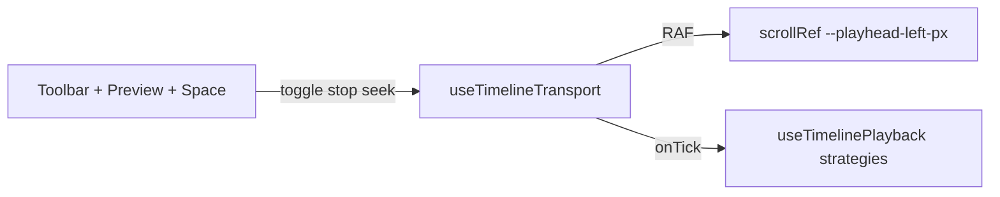

# Structure Timeline (Epic T55)

Architecture for the Structure tab timeline: one editor shell for film, series, book, and audio projects.

## Entry points

| Component | Role |
|-----------|------|
| `StructureTimelineView` | Structure tab wrapper |
| `StructureTimelineEditor` | Orchestrator (~6k LOC, shrinking per T50) |
| `getTimelineStrategy(projectType)` | Feature flags per project type |

Import from `@/components/structure/timeline`.

## Hooks (`src/hooks/timeline/`)

| Hook | Responsibility |
|------|----------------|
| `useTimelineTransport` | **Authoritative transport** — playing, positionSec, play/pause/stop/seek, 60fps RAF, `--playhead-left-px` on scroll container |
| `useTimelinePlayhead` | Deprecated re-export of `useTimelineTransport` |
| `useTimelinePlayback` | Unified play/pause/stop; delegates to book/audio/film strategies |
| `resolveTimelineTransportGuard` | `canPlay` + user-facing reason (book text, audio clips) |
| `useTimelineZoom` | Zoom, viewport, scroll anchor, ruler ticks |
| `useTimelineEditorData` | Beats loading (API or parent props) |

Trim/move bridges: `useStructureTimelineTrimBridge`, `useStructureTimelineMoveBridge` (legacy `useVetStructure*` shims).

## Transport authority (T61)

- **Clock:** `positionSecRef = anchorSec + elapsed` while `playingRef` is true (TheStuu-style interpolation, local).
- **Playhead:** All tracks use CSS class `.structure-timeline-playhead` reading `--playhead-left-px` from the shared scroll container — no per-track refs.
- **Controls:** Play/Pause (toggle), Stop (seek 0 + pause), Space = toggle, Home = stop.
- **Guard:** Buttons disabled when `canPlay` is false (e.g. book without scene text).
- **Scrub (CapCut-style):** Pointer capture on ruler playhead; absolute `clientX → timeSec`; pauses playback while dragging; ref + CSS updates at 60fps, React state throttled (~80ms); ruler click/tap seeks via `seekFromClientX`.

## Strategies (`src/components/structure/timeline/strategies/`)

`getTimelineStrategy` reads `projectTypeRegistry` — no duplicated feature flags in the editor shell.

- **book** — text preview, word index from transport `onTick`
- **audio** — DAW lanes, clip sync on every transport tick
- **film/series** — shot/editorial tracks, image preview from `positionSec`

## Tracks (`src/components/structure/timeline/tracks/`)

`BeatTrack`, `ActTrack`, `SequenceTrack`, `SceneTrack`, `ShotTrack`, `StructureTimelineAudioLanes`.

## Layout sources

- **Canonical (film/hybrid):** `src/lib/timeline-tree/projectBlocks.ts` + `buildTree.ts`
- **Book word timing:** `src/lib/timeline-book-duration.ts`
- **Legacy fallback:** `src/components/timeline-blocks.ts` (deprecated when tree ripple is off)

## Playback

One transport clock for all types. Book highlights words via `useTimelinePlaybackBookEngine.onTick`. Audio clips sync via `useTimelinePlaybackAudioEngine.onTick` + `resolveClipPlaybackUrl`.

## Related docs

- `tickets/todo-T61-implementation-timeline-transport-capcut.md`
- `docs/pages/ventilalorapp.md` — ripple engine + timeline tree
- `docs/DESKTOP_FIRST_DEV.md` — local runtime defaults
