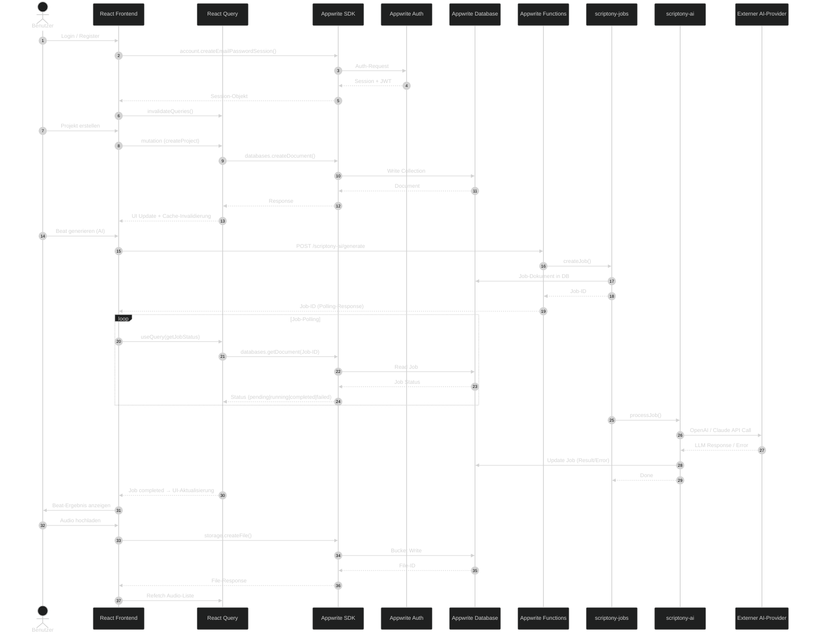
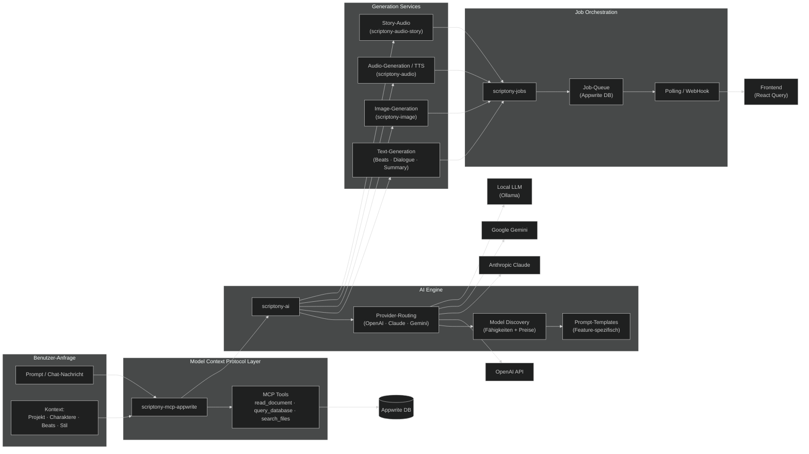
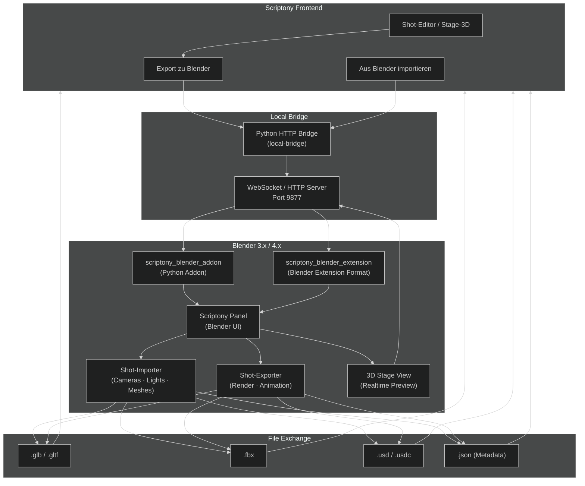

# Scriptony — Gesamtarchitektur

```mermaid
---
title: Scriptony Gesamtarchitektur
config:
  theme: dark
  flowchart:
    rankSpacing: 50
    nodeSpacing: 30
    curve: basis
---

flowchart TB
    subgraph Users["Benutzer & Geräte"]
        direction TB
        Browser["Web-Browser"]
        Mobile["Mobile App (Capacitor)"]
        Desktop["Desktop (Vite PWA)"]
    end

    subgraph CDN["Delivery Layer"]
        Vercel["Vercel Edge\n(Frontend Hosting)"]
    end

    subgraph Frontend["Frontend — React + Vite + TypeScript"]
        direction TB
        subgraph UI_Components["UI-Komponenten (Radix UI + Tailwind)"]
            Layout["Layout & Navigation"]
            Editors["Editor-Komponenten"]
            Dialogs["Dialoge & Popups"]
            Media["Media Player & Timeline"]
        end
        subgraph State_Layer["State & Logic"]
            ReactQuery["React Query\n(Server State)"]
            AuthHook["useAuth\n(AuthContext)"]
            CustomHooks["Custom Hooks\n(Beats, Timeline, Jobs, ...)"]
        end
        subgraph Router["Routing"]
            AppContent["AppContent\n(Router)"]
            Pages["Pages:\nLogin · Projects · Editor\nBeats · Timeline · Settings"]
        end
    end

    subgraph BridgeLayer["Lokale Bridge & DCC-Tools"]
        direction TB
        Bridge["local-bridge\n(Python HTTP Bridge)"]
        BlenderAddon["Blender Addon"]
        BlenderExt["Blender Extension"]
    end

    subgraph AppwritePlatform["Appwrite Platform"]
        direction TB
        Auth["Appwrite Auth\n(OAuth + Magic Link + Email)"]
        Database["Appwrite Database\n(Dokumente & Collections)"]
        Storage["Appwrite Storage\n(Buckets)"]
        Realtime["Appwrite Realtime\n(Subscriptions)"]
        Functions["Appwrite Functions\n(Serverless Node/Hono)"]
    end

    subgraph Functions["Backend Functions (Hono + esbuild)"]
        direction TB
        subgraph CoreFuncs["Kern-Funktionen"]
            FAuth["scriptony-auth"]
            FProjects["scriptony-projects"]
            FNodes["scriptony-project-nodes"]
            FChars["scriptony-characters"]
            FBeats["scriptony-beats"]
            FShots["scriptony-shots"]
            FClips["scriptony-clips"]
        end
        subgraph MediaFuncs["Media & Assets"]
            FImage["scriptony-image"]
            FAudio["scriptony-audio"]
            FAudioStory["scriptony-audio-story"]
            FVideo["scriptony-video"]
            FAssets["scriptony-assets"]
        end
        subgraph AIFuncs["AI & Assistenz"]
            FAI["scriptony-ai\n(LLM-Routing)"]
            FAssistant["scriptony-assistant\n(Chat)"]
            FJobs["scriptony-jobs\n(Langlauf-Tasks)"]
            FMCP["scriptony-mcp-appwrite\n(Model Context Protocol)"]
        end
        subgraph StageFuncs["Stage & Visualisierung"]
            FStage["scriptony-stage"]
            FStage2D["scriptony-stage2d"]
            FStage3D["scriptony-stage3d"]
            FWorld["scriptony-worldbuilding"]
            FStyle["scriptony-style"]
            FStyleGuide["scriptony-style-guide"]
        end
        subgraph UtilFuncs["Utility & Admin"]
            FSync["scriptony-sync"]
            FGym["scriptony-gym"]
            FScript["scriptony-script"]
            FSAdmin["scriptony-superadmin"]
            FLogs["scriptony-logs"]
            FStats["scriptony-stats"]
            FReadModel["scriptony-editor-readmodel"]
        end
    end

    subgraph Shared["functions/_shared (Shared Library)"]
        direction TB
        SharedEnv["env.ts\n(Konfiguration)"]
        SharedZod["Zod-Schemas"]
        SharedAI["AI-Service\n(Model Discovery, Routing)"]
        SharedDB["DB-Helpers"]
        SharedUtils["Utilities"]
    end

    subgraph ExternalAI["Externe AI-Provider"]
        OpenAI["OpenAI\n(GPT-4o, DALL-E, TTS)"]
        Anthropic["Anthropic (Claude)"]
        OtherAI["Weitere Provider\nGemini, Mistral, Local..."]
    end

    subgraph DevOps["DevOps & Tooling"]
        direction TB
        Docker["Docker Compose\n(infra/appwrite)"]
        Shim["shimwrappercheck\n(Lint · Build · Test · AI Review)"]
        Scripts["scripts/\n(Deploy · Verify · Smoke Tests)"]
        GitHooks["Husky\nPre-push Hook"]
    end

    %% Connections: Users → Frontend
    Browser --> Vercel
    Mobile --> Vercel
    Desktop --> Vercel
    Vercel --> Frontend

    %% Frontend internal
    Router --> State_Layer --> UI_Components
    AppContent --> Pages

    %% Frontend → Appwrite
    ReactQuery --> Database
    AuthHook --> Auth
    CustomHooks --> Storage
    UI_Components --> Realtime

    %% Frontend → Bridge
    Media --> Bridge
    Bridge --> BlenderAddon
    Bridge --> BlenderExt

    %% Appwrite → Functions
    Functions --> CoreFuncs
    Functions --> MediaFuncs
    Functions --> AIFuncs
    Functions --> StageFuncs
    Functions --> UtilFuncs

    %% Functions → Shared
    CoreFuncs --> Shared
    MediaFuncs --> Shared
    AIFuncs --> Shared
    StageFuncs --> Shared
    UtilFuncs --> Shared

    %% Functions → Appwrite Services
    CoreFuncs --> Database
    MediaFuncs --> Storage
    FJobs --> Database
    FReadModel --> Database
    FAI --> Database
    FSync --> Database

    %% AI Functions → External
    FAI --> OpenAI
    FAI --> Anthropic
    FAI --> OtherAI
    FImage --> OpenAI
    FAudio --> OpenAI

    %% Functions ↔ Functions
    FJobs -.->|"triggers"| FAI
    FAI -.->|"status update"| FJobs
    FReadModel -.->|"aggregiert"| Database
    FSync -.->|"sync"| Database
    FMCP -.->|"kontext"| FAI
    FMCP -.->|"kontext"| Database

    %% DevOps
    Scripts --> Docker
    Scripts --> shimwrappercheck
    GitHooks --> Shim
    Shim --> Frontend
    Shim --> Functions

    %% Styling
    classDef frontend fill:#3b82f6,stroke:#1d4ed8,stroke-width:2px,color:#fff
    classDef backend fill:#10b981,stroke:#059669,stroke-width:2px,color:#fff
    classDef shared fill:#f59e0b,stroke:#d97706,stroke-width:2px,color:#fff
    classDef external fill:#8b5cf6,stroke:#7c3aed,stroke-width:2px,color:#fff
    classDef infra fill:#64748b,stroke:#475569,stroke-width:2px,color:#fff
    classDef user fill:#ef4444,stroke:#dc2626,stroke-width:2px,color:#fff
    classDef bridge fill:#06b6d4,stroke:#0891b2,stroke-width:2px,color:#fff
    classDef appwrite fill:#fd366e,stroke:#e11d48,stroke-width:2px,color:#fff
    classDef ai fill:#a855f7,stroke:#9333ea,stroke-width:2px,color:#fff

    class Browser,Mobile,Desktop user
    class Vercel infra
    class UI_Components,State_Layer,Router,AppContent,Pages,Layout,Editors,Dialogs,Media,ReactQuery,AuthHook,CustomHooks frontend
    class Bridge,BridgeLayer,BlenderAddon,BlenderExt bridge
    class CoreFuncs,MediaFuncs,AIFuncs,StageFuncs,UtilFuncs,FAuth,FProjects,FNodes,FChars,FBeats,FShots,FClips,FImage,FAudio,FAudioStory,FVideo,FAssets,FAI,FAssistant,FJobs,FMCP,FStage,FStage2D,FStage3D,FWorld,FStyle,FStyleGuide,FSync,FGym,FScript,FSAdmin,FLogs,FStats,FReadModel backend
    class Shared,SharedEnv,SharedZod,SharedAI,SharedDB,SharedUtils shared
    class OpenAI,Anthropic,OtherAI,ai
    class Auth,Database,Storage,Realtime,Functions appwrite
    class Docker,Shim,Scripts,GitHooks infra
```

---

## Detail-Diagramm: Datenfluss Frontend ↔ Backend



---

## Detail-Diagramm: AI-Pipeline



---

## Detail-Diagramm: Blender / DCC Integration



---

## Legend: Farbcodierung

| Farbe | Bedeutung |
|-------|-----------|
| 🔴 Rot | Benutzer / Geräte |
| 🔵 Blau | Frontend (React) |
| 🩵 Cyan | Lokale Bridge / DCC-Tools |
| 💗 Pink | Appwrite Platform-Dienste |
| 🟢 Grün | Backend Functions |
| 🟠 Orange | Shared Library (_shared) |
| 🟣 Violett | Externe AI-Provider |
| Grau | DevOps / Tooling |

---

*Diagramm erstellt am: 2026-04-27*
*Projekt: scriptony-appwrite*
