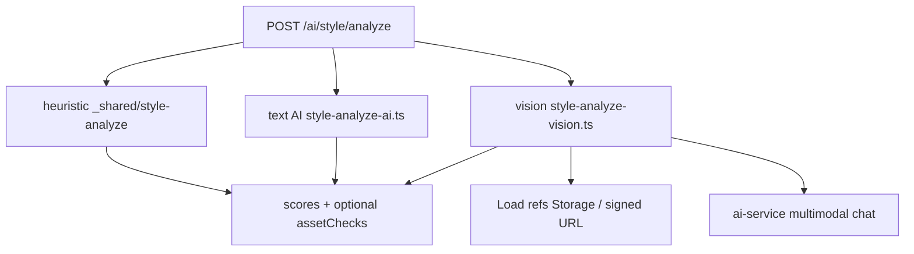

# T91 — Style Vision-Analyse (Plan)

**Status:** todo  
**Typ:** plan  
**Phase:** 4  
**Parent:** [T97 Roadmap](./todo-T97-plan-puppet-layer-phase4-roadmap.md)  
**Voraussetzung:** T85 Validation-Upload ✅, T98 Deploy empfohlen, Multimodal-Provider in `ai-service`

## Problem

**Heute (`mode: ai`):** Text-LLM bewertet Spec-Zusammenfassung — **kein Blick** auf hochgeladene Validation-Bilder.

Nutzer erwarten: „Passt dieses Character-Referenzbild zu meiner Palette und Line-System?“

## Ziel (KISS)

Erweiterung von `POST /ai/style/analyze`:

```ts
Body: {
  profileId?: string;
  spec?: StyleProfileSpec;
  mode: "heuristic" | "ai" | "vision";  // vision = multimodal
}

Response: {
  scores: StyleAnalysisScores;  // bestehend
  mode: string;
  assetChecks?: Array<{
    slotIndex: number;
    slotLabel: string;
    status: "ok" | "warn" | "fail" | "skipped";
    message?: string;
  }>;
}
```

**Fallback-Kette (DRY):** `vision` → bei Fehler/kein Provider → `ai` → `heuristic` (client spiegelt `analyze-style-remote.ts`).

## Architektur



| Modul | Verantwortung |
|-------|----------------|
| `_shared/style-analyze.ts` | Heuristik + **validationCoverage** (bereits T89) |
| `style-analyze-ai.ts` | Text-Blend (bereits) |
| `style-analyze-vision.ts` | **neu** — 1 Request pro Slot oder 1 Batch |
| `style-validation-assets.ts` | Refs lesen aus Spec (DRY mit Upload-Patch) |

### Vision-Prompt (pro Slot, KISS)

```
System: Style consistency reviewer for animation.
User: [image] + JSON: { palette, lineRules, slotLabel: "Character" }
Reply: STATUS: ok|warn|fail — one line reason.
```

Parser: einfaches Regex — kein JSON-Schema-Zwang.

## Bild-URLs

| Ref-Typ | Auflösung |
|---------|-----------|
| Appwrite file ID | `buildStorageFileViewUrl` server-side oder Storage SDK `getFileView` |
| `assets/…` local | **vision nur Cloud** — Slot `skipped` mit message „local asset“ |

Desktop: Hybrid mit deployed Function; rein local ohne Cloud → Tooltip „Vision benötigt Cloud“.

## Frontend

| Änderung | Datei |
|----------|-------|
| `mode: "vision"` in remote analyze | `analyze-style-remote.ts` |
| Asset-Ampeln im Grid | `ValidationAssetGrid.tsx` |
| Breakdown „Assets: 4/6 ok“ | `StyleScoreBreakdown.tsx` |

Hook `useStyleProfileAnalysis`: Button „Analysieren“ ruft `vision` wenn Assets vorhanden + Cloud.

## Provider-Voraussetzung

- `ai-service` Provider mit **image input** (OpenAI vision, OpenRouter multimodal, etc.)
- Feature-Flag: `assistant_chat` oder neues `style_vision` in `resolveFeatureRuntime`
- Kein neuer Appwrite Function — erweitert `scriptony-style` only

## Acceptance

- [ ] `mode: vision` liefert `assetChecks` für ≥1 Slot mit Cloud-Storage-Ref
- [ ] Leere Slots: `skipped`
- [ ] Local-only refs: `skipped`, nicht 500
- [ ] UI zeigt Ampel pro Validation-Slot
- [ ] Fallback auf Heuristik ohne Crash

## Checks

```bash
CHECK_MODE=snippet SHIM_CHECKS_ARGS="--backend" \
  SHIM_CHANGED_FILES="functions/scriptony-style/style-analyze-vision.ts,functions/scriptony-style/index.ts,functions/_shared/style-profile-schema.ts" \
  npm run checks
```

## Nicht-Ziele

- Pixel-genaue Palette-Extraktion (CV/OpenCV) — nur LLM-Vision v1
- Video-Validation
- Automatisches Überschreiben des Spec bei Fail

## Folge-Ticket

`todo-T91-implementation-style-vision-analyze.md`

## Abhängigkeit zu T98

Vision sinnvoll erst mit deployed `scriptony-style` + Storage-Zugriff auf Validation-Assets.
