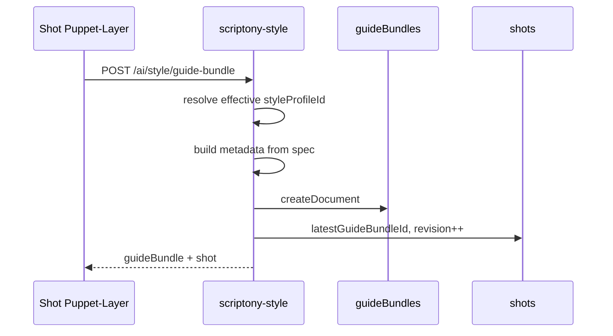

# T96 — GuideBundle aus StyleProfileSpec (Plan)

**Status:** todo  
**Typ:** plan  
**Phase:** 3  
**Parent:** [T97 Roadmap](./todo-T97-plan-puppet-layer-phase4-roadmap.md)  
**Basis:** [`concepts/puppet-layer-concept.de.md`](../concepts/puppet-layer-concept.de.md) §17, `guideBundles` Collection, `scriptony-sync/sync-service.ts`

## Problem

**Heute:** GuideBundles entstehen über Blender-Ingress (`POST /sync/guides`) mit Depth/Lineart-Dateien. StyleProfileSpec und GuideBundle sind **nicht verbunden**.

**RenderJobs** brauchen `guideBundleId` + aufgelöstes `styleProfileId` — Nutzer müssen manuell zwischen Style-Editor und Puppet-Layer wechseln.

## Ziel (KISS)

**Spec-only GuideBundle** — maschinenlesbares JSON aus `StyleProfile.spec`, **ohne** Blender-Render im Backend:

1. API erzeugt `guideBundles`-Dokument + optional Storage-JSON (`specRef`-ähnlich)
2. Shot erhält `latestGuideBundleId`, `guideBundleRevision++`
3. UI: „Guide aus Style generieren“ im Shot Puppet-Layer

Volles **GuideBundle v2** (depth, normal, masks) bleibt Blender-Pfad — Spec-Bundle ist **Subset** mit `source.engine: "style-profile"`.

## Zieldatenmodell (minimal)

```ts
// In guideBundles.metadata (JSON string) — KISS v1
type StyleGuideBundleMetadata = {
  version: 1;
  source: { engine: "style-profile"; profileId: string; profileVersion: number };
  style: {
    compactPrompt?: string;
    palette?: string[];
    doItems?: string[];
    avoidItems?: string[];
    toolSettings?: { imageGeneration?: Record<string, unknown> };
  };
  resolvedProfileId: string; // nach resolve-effective-profile
};
```

Collection-Felder (bestehend): `shotId`, `userId`, `revision`, `files` (`"{}"` oder Preview-refs), `metadata`.

## API (neu)

```
POST /ai/style/guide-bundle
Body: {
  projectId: string;
  shotId: string;
  styleProfileId?: string;  // optional — sonst resolve-effective
}
→ 201 {
  guideBundle: { id, revision, ... },
  shot: { latestGuideBundleId, guideBundleRevision, styleProfileId }
}
```

**Ort:** `scriptony-style` (Style-Domain) — **nicht** `scriptony-sync` (Blender-Ingress bleibt getrennt, SOLID).

## Backend-Module (SOLID)

| Modul | Pfad |
|-------|------|
| Generator | `functions/scriptony-style/guide-bundle-from-spec.ts` |
| Route | `functions/scriptony-style/index.ts` |
| Shot-Update | reuse `getStyleShotById` + `updateDocument(C.shots)` |
| Schema | Zod: `createGuideBundleFromSpecBodySchema` in `_shared/` oder style-local |

**DRY:** `resolveShotStyleProfile` / effective profile aus Step 4 wiederverwenden; `buildAndValidateSummary` / `compactPrompt` aus Spec.

## Frontend (nach Backend)

| Stück | Pfad |
|-------|------|
| HTTP | `src/lib/api/style-guide-bundle-api.ts` |
| Adapter | `dispatchByRuntime` — Cloud HTTP; Local: SQLite `guide_bundles` **oder** Cloud-only v1 |
| UI | `ShotStyleOverrideControls` oder `RenderJobPanel` — Button „Guide aus Style“ |
| Freshness | bestehende `guideBundleRevision` / `styleProfileRevision` Logik |

### Desktop v1 (KISS)

- **Hybrid mit Cloud:** API aufrufen, Shot-Felder lokal nicht spiegeln nötig wenn nur Cloud-Renders
- **Strikt local:** deferred — optional T96b lokales `guide_bundles` in SQLite

## Ablauf (Sequenz)



## Acceptance

- [ ] Route deployed (nach T98)
- [ ] GuideBundle.metadata enthält Spec-Kern (palette, prompt, profileVersion)
- [ ] Shot `guideBundleRevision` inkrementiert
- [ ] RenderJob create kann neue `guideBundleId` nutzen
- [ ] Freshness: guides nicht mehr stale vs. `styleProfileRevision` (wenn Revision aus Profil-Version)

## Checks

```bash
CHECK_MODE=snippet SHIM_CHECKS_ARGS="--backend" \
  SHIM_CHANGED_FILES="functions/scriptony-style/guide-bundle-from-spec.ts,functions/scriptony-style/index.ts" \
  npm run checks
```

## Nicht-Ziele (v1)

- Depth/Normal/Lineart-Files generieren (Blender)
- ComfyUI-Workflow aus Spec starten
- GuideBundle v2 vollständig (`concepts/puppet-layer-concept.de.md` §17 assets.*)

## Folge-Tickets

- `todo-T96-implementation-guide-bundle-from-spec.md`
- Optional `todo-T96b-implementation-guide-bundle-local.md` — SQLite für rein local
