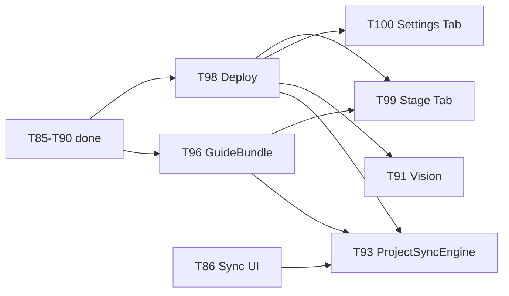

# T97 — Puppet-Layer Phase 4 Roadmap (Master-Plan)

**Status:** todo  
**Typ:** plan  
**Basis:** T85 ✅, T86–T90 ✅, [`docs/STYLEGUIDE_SYSTEM_CONCEPT.md`](../docs/STYLEGUIDE_SYSTEM_CONCEPT.md) Steps 3–6, [`concepts/puppet-layer-concept.de.md`](../concepts/puppet-layer-concept.de.md)

## Ausgangslage

| Bereich | Heute | Lücke |
|---------|-------|-------|
| Style Profiles | Rich UI, Sync, Overrides, Validation-Upload | Cloud-Deploy fehlt für Hybrid-Nutzer |
| Analyse | Heuristik + Text-LLM (`mode: ai`) | Keine Vision gegen hochgeladene Assets |
| Sync | `style-profile-sync-engine.ts` (nur Profiles) | Kein projektweiter Orchestrator |
| Puppet-Pipeline | RenderJobs, Freshness, Overrides | GuideBundle kommt von Blender/Sync, nicht aus Spec |
| Projekt-IA | Subnav: Übersicht \| Struktur \| Cast \| Styles \| Renders | Stage + Settings fehlen |

## Phasen (verbindliche Reihenfolge)

```
Phase 1  T98  Cloud Deploy (style + stage)     → Hybrid sofort nutzbar
Phase 2  T99  Subnav Stage                   → Puppet-Übersicht
         T100 Subnav Settings                 → Sync + Projekt-Config
Phase 3  T96  GuideBundle aus Spec           → Pipeline-Lücke
Phase 4  T91  Vision-Analyse                 → Validation-Mehrwert
Phase 5  T93  ProjectSyncEngine              → Hybrid end-to-end
```

**Parallel erlaubt:** T99/T100 nach T98, unabhängig voneinander. T96 blockiert nicht T91. T93 sollte nach T98 (Cloud-APIs stabil) und idealerweise nach T96 (mehr Sync-Entitäten).

## Architektur-Prinzipien (KISS / SOLID / DRY)

| Prinzip | Regel |
|---------|-------|
| **KISS** | Kein neues Framework; erweitern was existiert (`scriptony-style`, `ProjectDetailSubnav`, `hybrid-cloud-push`) |
| **SOLID** | Eine Verantwortung pro Modul: Deploy ≠ UI ≠ GuideGenerator ≠ Vision ≠ SyncOrchestrator |
| **DRY** | Shared: `_shared/style-analyze.ts`, `resolve-effective-profile.ts`, `FreshnessBadge`, `dispatchByRuntime` — nicht duplizieren |
| **Desktop-first** | Jede Cloud-Feature braucht lokalen Pfad oder klaren „Cloud-only“-Hinweis |
| **Adapter** | UI → `src/lib/api-adapter/` + `style-profile-api` — kein raw `fetch` in Components |

## Abhängigkeitsgraph



## Ticket-Index

| Ticket | Typ | Datei |
|--------|-----|-------|
| T98 | plan + Deploy-Checkliste | [`todo-T98-plan-cloud-deploy-style-stage.md`](./todo-T98-plan-cloud-deploy-style-stage.md) |
| T99 | plan | [`todo-T99-plan-project-subnav-stage.md`](./todo-T99-plan-project-subnav-stage.md) |
| T100 | plan | [`todo-T100-plan-project-subnav-settings.md`](./todo-T100-plan-project-subnav-settings.md) |
| T96 | plan | [`todo-T96-plan-guide-bundle-from-spec.md`](./todo-T96-plan-guide-bundle-from-spec.md) |
| T91 | plan | [`todo-T91-plan-style-vision-analyze.md`](./todo-T91-plan-style-vision-analyze.md) |
| T93 | plan | [`todo-T93-plan-project-sync-engine.md`](./todo-T93-plan-project-sync-engine.md) |

## Nach Abschluss aller Phasen (Zielbild)

- Hybrid-Nutzer: Style-Analyse, Validation-Upload, Projekt-Renders, Overrides — **in Cloud live**
- Projekt-Subnav: **7 Tabs** (inkl. Stage, Settings)
- Shot-Puppet: **GuideBundle aus StyleProfileSpec** + RenderJob mit aufgelöstem Profil
- Validation: **Vision-Scores pro Asset-Slot** (wenn Cloud-KI + Deploy)
- Desktop: **Ein Sync-Button** synchronisiert Profiles + (schrittweise) Characters, Timeline-Metadaten

## Doku-Updates (einmalig nach Phase 1+2)

- [ ] `docs/STYLEGUIDE_SYSTEM_CONCEPT.md` Steps 3–6 auf Ist-Stand
- [ ] `docs/DESKTOP_FIRST_DEV.md` — wann Deploy nötig ist

## Nicht-Ziele (gesamt)

- ComfyUI/Blender **ausführen** im Appwrite-Backend
- Vollbild `#projekte/{id}/styles` als eigener Screen
- App-Theme wechseln pro Style-Preset
- Real-time CRDT / Multi-User-Kollaboration (→ T25)
